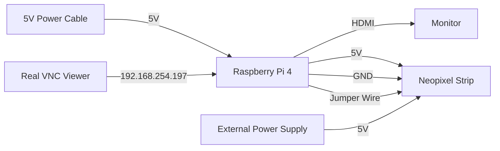
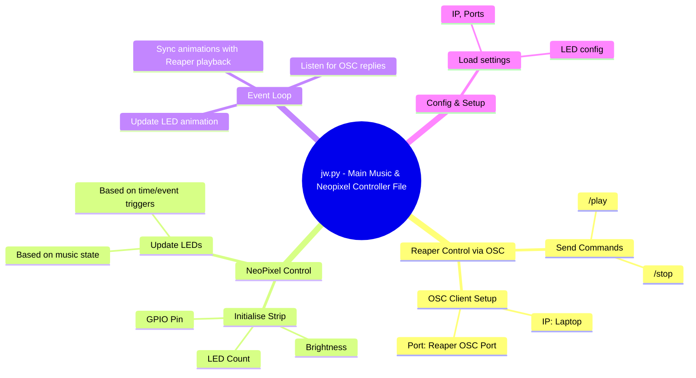

## Introduction to my **EGL314** Project By Phoa Jian Wei

My EGL314 Project is a Raspberry Pi 4 project that consists of 3 different major projects segments,  being Neopixel Lighting, Mounted Fixture Lighting and Audio Transmission. Currently, I am working on the Neopixel Section where I am supposed to create a 30 second Neopixel 
Sequence that is unique to me. A Neopixel lighting strip is a LED strip that can be controlled using a GPIO Pin that uses Pulse-Width Modulation(PWM) and DMA that is located on the Raspberry Pi 4.

### What is Pulse-Width Modulation(PWM) ?
Pulse Width Modulation (PWM) is a digital technique used to control analog outputs by varying the width of pulses while keeping the frequency constant.

### What is a GPIO Pin ?
A General Purpose Input/Output (GPIO) pin is a versatile, programmable digital pin that can be configured by software to act as either an input or an output.

### How does GPIO Pin and Hardware PWM effectively communicate and control the Neopixels via the Raspberry Pi ?
Since NeoPixels (WS2812-type LEDs) require very strict timing on the data signal. Any jitter or delay (even a few hundred nanoseconds) can cause the entire LED strip to glitch or ignore the signal. Thus, since GPIO Pins support Precise Timing Control, DMA, and is compatible with the rpi_ws281x library which uses DMA Protocol, GPIO Pin is widely used to control Neopixels as it ensures a solid data stream to the Neopixels.


### **Dependencies** used in my project
**Hardware**
* Neopixel Strip(Ws2812-type LED)
* Raspberry Pi 4 Model B
* 13A to  USB-C x2

**Software**
* Visual Studio Code
* RealVNC Viewer

**Python Packages**
* GPIO Protocol
* rpi_ws281x Library(LED Library for Raspberry Pi)
* sudo ~/<venv_name>/bin/python jw.py
* sudo usermod -a -G gpio (username)

**System Diagram**


**Code Logic**



**My Final Code with 30 Second Music**
```    
import time
import random
from rpi_ws281x import *
from pythonosc import udp_client

def send_message(receiver_ip, receiver_port, address, message):
	try:
		# Create an OSC client to send messages
		client = udp_client.SimpleUDPClient(receiver_ip, receiver_port)

		# Send an OSC message to the receiver
		client.send_message(address, message)

		print("Message sent successfully.")
	except:
		print("Message not sent")

# FOR INFO: IP address and port of the receiving Raspberry Pi
PI_A_ADDR = "192.168.254.74"		# wlan ip
PORT = 8000

addr = "/action/40044" # Play/Stop Function in Reaper
msg = float(1) # Trigger TRUE Value

send_message(PI_A_ADDR, PORT, addr, msg)


# LED strip configuration:
LED_COUNT = 100       # Number of LED pixels.
LED_PIN = 12            # GPIO pin connected to the pixels (18 uses PWM).
LED_FREQ_HZ = 800000    # LED signal frequency in hertz (usually 800kHz)
LED_DMA = 10            # DMA channel to use for generating signal (try 10)
LED_BRIGHTNESS = 255    # Overall strip brightness (0 to 255)
LED_INVERT = False      # True to invert the signal (use only if needed)

# Create NeoPixel object with appropriate configuration.
strip = Adafruit_NeoPixel(LED_COUNT, LED_PIN, LED_FREQ_HZ, LED_DMA, LED_INVERT, LED_BRIGHTNESS)
strip.begin()


def setStaticWhite(strip, brightness=255):
    """Set all LEDs to static white with a given brightness."""
    color = Color(brightness, brightness, brightness)  # Simulate brightness via RGB values
    for i in range(strip.numPixels()):
        strip.setPixelColor(i, color)
    strip.show()

def turnOffLEDs(strip):
    """Turn off all LEDs."""
    for i in range(strip.numPixels()):
        strip.setPixelColor(i, Color(0, 0, 0))
    strip.show()

def setRangeColor(strip, start, end, color):
    """Set a range of pixels to the same color."""
    for i in range(start, end):
        strip.setPixelColor(i, color)
    strip.show()

def set_all_pixels(strip, color):
    for i in range(strip.numPixels()):
        strip.setPixelColor(i, color)
    strip.show()

def wheel(pos):
    """Generate rainbow colors across 0–255 positions."""
    if pos < 85:
        return Color(pos * 3, 255 - pos * 3, 0)
    elif pos < 170:
        pos -= 85
        return Color(255 - pos * 3, 0, pos * 3)
    else:
        pos -= 170
        return Color(0, pos * 3, 255 - pos * 3)

def flicker_torches(strip, duration=5):
    """Simulate torch flickering with warm tones (5 seconds)."""
    end_time = time.time() + duration
    while time.time() < end_time:
        for i in range(strip.numPixels()):
            r = random.randint(100, 180)
            g = random.randint(40, 90)
            b = 0
            strip.setPixelColor(i, Color(r, g, b))
        strip.show()
        time.sleep(random.uniform(0.05, 0.15))

def calm_pulse(strip, duration=3):
    """Pulse soft golden light (3 seconds)."""
    steps = 50
    for cycle in range(int(duration * 2)):
        for i in range(steps):
            intensity = int((1 - abs((i / (steps / 2)) - 1)) * 255)
            r = intensity
            g = intensity // 2
            b = 0
            color = Color(r, g, b)
            for j in range(strip.numPixels()):
                strip.setPixelColor(j, color)
            strip.show()
            time.sleep(0.03)

def color_pulse(strip, color, pulse_count=3, interval=1):
    """Pulse a solid color on and off."""
    for _ in range(pulse_count):
        set_all_pixels(strip, color)
        time.sleep(interval / 2)
        turnOffLEDs(strip)
        time.sleep(interval / 2)

def chase(strip, color, delay=0.05, loops=2):
    """Chase effect: one bright pixel moving down the strip."""
    for _ in range(loops):
        for i in range(strip.numPixels()):
            turnOffLEDs(strip)
            strip.setPixelColor(i, color)
            strip.show()
            time.sleep(delay)

def alternate_flash(strip, color1, color2, flashes=3, interval=1):
    """Alternate two full-strip colors."""
    for _ in range(flashes):
        set_all_pixels(strip, color1)
        time.sleep(interval / 2)
        set_all_pixels(strip, color2)
        time.sleep(interval / 2)

def fade_out_white(strip, steps=20, duration=2):
    """Fade from white to black."""
    for i in range(steps, -1, -1):
        brightness = int(255 * i / steps)
        set_all_pixels(strip, Color(brightness, brightness, brightness))
        time.sleep(duration / steps)

 
try:
    setStaticWhite(strip)
    flicker_torches(strip, 4)        # 🔥 Flickering firelight
    calm_pulse(strip, 2)             # ✨ Soft pulse of sacred energy
    color_pulse(strip, Color(255, 0, 0), pulse_count=2, interval=1)  # 10-11s Red Pulse x2 2s Duration
    color_pulse(strip, Color(0, 255, 0), pulse_count=2, interval=1)  # 12-13s Green Pulse x2 2s Duration
    color_pulse(strip, Color(0, 0, 255), pulse_count=2, interval=1)  # 14-15s Blue Pulse x2 2s Duration
    chase(strip, Color(0, 255, 0), delay=0.01, loops=1)  # 16-17s Chase 1s Duration
    chase(strip, Color(255, 165, 0), delay=0.01, loops=1)  # 18-19s Chase 1s Duration
    chase(strip, Color(128, 0, 128), delay=0.01, loops=1)  # 18-19s Chase 1s Duration
    alternate_flash(strip, Color(128, 0, 0), Color(0, 0, 128), flashes=3, interval=1)  # 20-24s Red & Navy Blue Flashes 5s Duration
    setRangeColor(strip, 0, 100, Color(255,255,255))
    fade_out_white(strip, steps=20, duration=4)  # 29-30s Fade Out from White to Black 2s Duration
    turnOffLEDs(strip)
    


    while True:
        pass
except KeyboardInterrupt:
    turnOffLEDs(strip)


        
        
       


