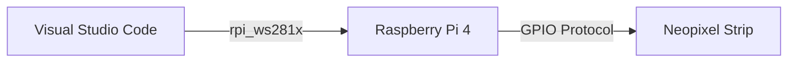

## Introduction to my **EGL314** Project By Phoa Jian Wei

My EGL314 Project is a Raspberry Pi 4 project that consists of 3 different major projects segments,  being Neopixel Lighting, Mounted Fixture Lighting and Audio Transmission. Currently, I am working on the Neopixel Section where I am supposed to create a 30 second Neopixel 
Sequence that is unique to me. A Neopixel lighting strip is a LED strip that can be controlled using a GPIO Pin that uses Pulse-Width Modulation(PWM) and DMA that is located on the Raspberry Pi 4.

### What is Pulse-Width Modulation(PWM) ?
Pulse Width Modulation (PWM) is a digital technique used to control analog outputs by varying the width of pulses while keeping the frequency constant.

### What is a GPIO Pin ?
A General Purpose Input/Output (GPIO) pin is a versatile, programmable digital pin that can be configured by software to act as either an input or an output.

### How does GPIO Pin and Hardware PWM effectively communicate and control the Neopixels via the Raspberry Pi ?
Since NeoPixels (WS2812-type LEDs) require very strict timing on the data signal. Any jitter or delay (even a few hundred nanoseconds) can cause the entire LED strip to glitch or ignore the signal. Thus, since GPIO Pins support Precise Timing Control, DMA, and is compatible with the rpi_ws281x library which uses DMA Protocol, GPIO Pin is widely used to control Neopixels as it ensures a solid data stream to the Neopixels.


### **Dependencies** used in my project
**Hardware**
* Neopixel Strip(Ws2812-type LED)
* Raspberry Pi 4 Model B
* 13A to  USB-C x2

**Software**
* Visual Studio Code
* RealVNC Viewer

**Python Packages**
* GPIO Protocol
* rpi_ws281x Library(LED Library for Raspberry Pi)
* sudo ~/<venv_name>/bin/python jw.py
* sudo usermod -a -G gpio (username)

**System Diagram**


**Code Logic**


When I run the code in Visual Studio Code, it fetches the relevant resources from the Raspberry Pi Neopixel Library(rpi_ws281x).

When resources are fetched, it is then sent to the Raspberry Pi's Processor, which is then sent out to the Neopixel Strip connected to the GPIO18 via GPIO protocol.

The Neopixel Strip will then receive the resources and comprehend it and execute the given resources, which will in turn make the Neopixel Strip change in colour according to the code.


**My Initial Code**
```     
import time
from rpi_ws281x import *

# LED strip configuration:
LED_COUNT = 300         # Number of LED pixels.
LED_PIN = 18            # GPIO pin connected to the pixels (18 uses PWM).
LED_FREQ_HZ = 800000    # LED signal frequency in hertz (usually 800kHz)
LED_DMA = 10            # DMA channel to use for generating signal (try 10)
LED_BRIGHTNESS = 255    # Overall strip brightness (0 to 255)
LED_INVERT = False      # True to invert the signal (use only if needed)

# Create NeoPixel object with appropriate configuration.
strip = Adafruit_NeoPixel(LED_COUNT, LED_PIN, LED_FREQ_HZ, LED_DMA, LED_INVERT, LED_BRIGHTNESS)
strip.begin()

def setStaticWhite(strip, brightness=255):
    """Set all LEDs to static white with a given brightness."""
    color = Color(brightness, brightness, brightness)  # Simulate brightness via RGB values
    for i in range(strip.numPixels()):
        strip.setPixelColor(i, color)
    strip.show()

def turnOffLEDs(strip):
    """Turn off all LEDs."""
    for i in range(strip.numPixels()):
        strip.setPixelColor(i, Color(0, 0, 0))
    strip.show()

def setRangeColor(strip, start, end, color):
    """Set a range of pixels to the same color."""
    for i in range(start, end):
        strip.setPixelColor(i, color)
    strip.show()

def set_all_pixels(strip, color):
    for i in range(strip.numPixels()):
        strip.setPixelColor(i, color)
    strip.show()

def wheel(pos):
    """Generate rainbow colors across 0–255 positions."""
    if pos < 85:
        return Color(pos * 3, 255 - pos * 3, 0)
    elif pos < 170:
        pos -= 85
        return Color(255 - pos * 3, 0, pos * 3)
    else:
        pos -= 170
        return Color(0, pos * 3, 255 - pos * 3)

# 1. To Set Individual Pixels(Dimmed Brightness)

    strip.setPixelColor(8, Color(50, 0, 50))   # Purple-ish(Dimmed)
    time.sleep(2)

    # 2. To Set Individual Pixels(Max Brightness)
    strip.setPixelColor(9, Color(255, 0, 255)) # Purple(Max)
    time.sleep(2)

    # 3. Set All Pixels(Max Brightness)
    set_all_pixels(strip, Color(0, 0, 255))# Blue(Max)
    time.sleep(2)

    # 4. Yellow (All Pixels)
    set_all_pixels(strip, Color(255, 255, 0))  # Yellow
    time.sleep(2)

    # 5. Yellow (Individual Pixels)
    strip.setPixelColor(10, Color(255, 255, 0))  # Yellow
    time.sleep(2)

     # 6. Color Changing Sequence(All Pixels)
    set_all_pixels(strip, Color(255, 0, 0))  # Red
    time.sleep(2)

    set_all_pixels(strip, Color(0, 255, 0))  # Green
    time.sleep(2)

    set_all_pixels(strip, Color(0, 0, 255))  # Blue
    time.sleep(2)

    set_all_pixels(strip, Color(255, 255, 0))  # Yellow
    time.sleep(2)

    set_all_pixels(strip, Color(255, 255, 255))  # White
    time.sleep(2)

    # 7. Turn off (0 seconds)
    turnOffLEDs(strip)

    # 8. Rainbow fade (10 seconds)(All Pixels)
    for j in range(256):
        for i in range(strip.numPixels()):
            strip.setPixelColor(i, wheel((i + j) & 255))
            strip.show()
            time.sleep(10 / 256.0)

        
        
       


